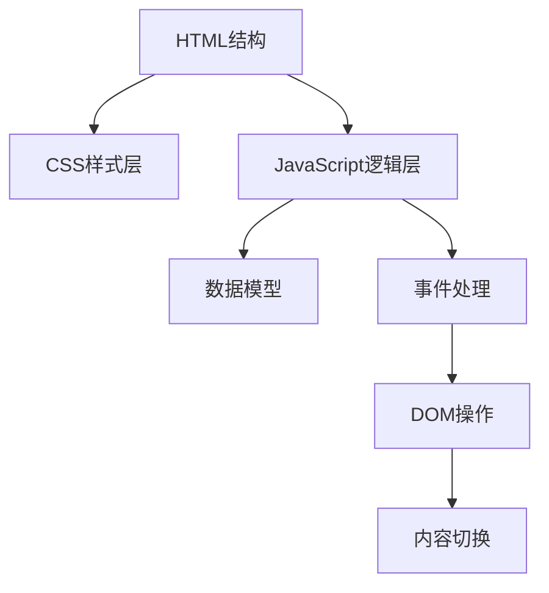

## 产品概述

创建一个专业的企业生态链和IoT平台分析单页应用网站，系统展示涂鸦智能的四个发展时期（2014-2016年技术积累期、2017-2019年平台建设期、2020-2021年快速扩张期、2022-2026年盈利优化期）以及行业适配性和经验可复制性研究成果。网站包含6个时期板块、13个核心分析维度、关键数据分析和核心能力展示模块，采用HTML+CSS+JavaScript实现响应式设计，为用户提供直观的企业发展历程洞察。

## 核心功能

- 顶部固定导航栏：显示"生态链&IoT平台建设历程分析"标题，右侧展示小米生态链及IoT、涂鸦智能IoT、华为生态链三个企业标签
- 中部6个时期板块：横向排列展示2014-2016年积累期、2017-2019年建设期、2020-2021年扩张期、2022-2026年盈利期、深度分析、经验复用六个板块
- 底部13个核心分析维度：战略与定位、技术支撑、市场拓展、组织建设、资源整合、商业模式、产品策略、竞争壁垒、风险控制、创新机制、国际化、生态协同、财务表现等维度的标签页切换
- 关键数据分析模块：展示各时期的核心指标、增长率、市场份额等关键数据
- 核心能力展示模块：展示涂鸦智能在平台能力、技术能力、生态能力等方面的核心优势
- 关键时间轴：底部展示企业发展的重要里程碑时间节点
- 响应式布局：移动端和桌面端自适应
- 交互功能：标签点击平滑切换内容，鼠标悬停效果

## 技术栈

- 前端架构：HTML5 + CSS3 + JavaScript（ES6+）
- 样式：原生CSS3，使用Flexbox和Grid布局
- 响应式设计：CSS Media Queries
- 交互：原生JavaScript事件处理
- 数据存储：JavaScript对象存储内容数据

## 系统架构

### 整体架构

采用单页应用（SPA）架构，所有内容在一个HTML文件中，通过JavaScript控制内容显示和隐藏。



### 模块划分

- **导航模块**：顶部固定导航栏，包含标题和企业标签
- **时期板块模块**：6个横向排列的时期展示卡片
- **分析维度模块**：底部13个维度的标签切换系统
- **数据展示模块**：关键数据可视化展示
- **核心能力模块**：核心优势能力展示
- **时间轴模块**：企业发展里程碑展示

### 数据流

用户点击标签 → JavaScript事件捕获 → 更新激活状态 → DOM内容切换 → CSS动画过渡

## 实现细节

### 核心目录结构

```
网站/
├── index.html              # 主HTML文件
├── css/
│   └── style.css          # 样式文件
├── js/
│   └── main.js            # JavaScript逻辑文件
├── data/
│   └── content.js         # 内容数据
└── images/                # 图片资源目录
```

### 关键代码结构

**HTML结构**：

```html
<!DOCTYPE html>
<html lang="zh-CN">
<head>
    <meta charset="UTF-8">
    <meta name="viewport" content="width=device-width, initial-scale=1.0">
    <title>生态链&IoT平台建设历程分析</title>
    <link rel="stylesheet" href="css/style.css">
</head>
<body>
    <!-- 导航栏 -->
    <header class="navbar">...</header>
    
    <!-- 主内容区 -->
    <main class="main-content">
        <!-- 时期板块 -->
        <section class="period-section">...</section>
        
        <!-- 分析维度 -->
        <section class="analysis-section">...</section>
        
        <!-- 数据分析 -->
        <section class="data-section">...</section>
        
        <!-- 核心能力 -->
        <section class="capability-section">...</section>
        
        <!-- 时间轴 -->
        <section class="timeline-section">...</section>
    </main>
    
    <script src="data/content.js"></script>
    <script src="js/main.js"></script>
</body>
</html>
```

**数据结构**：

```javascript
const periodData = {
    '2014-2016': {
        title: '技术积累期',
        keyPoints: ['关键点1', '关键点2', ...],
        metrics: { ... }
    },
    // ...其他时期
};

const dimensions = [
    { id: 'strategy', name: '战略与定位', content: '...' },
    { id: 'tech', name: '技术支撑', content: '...' },
    // ...13个维度
];
```

### 技术实现计划

1. **项目初始化**：创建HTML基础结构和CSS样式框架
2. **导航栏实现**：固定定位、企业标签交互
3. **时期板块布局**：Flexbox横向排列、卡片设计
4. **分析维度切换**：JavaScript事件处理、内容动态加载
5. **数据可视化**：CSS图表、数字动画效果
6. **响应式适配**：Media Queries移动端布局调整
7. **交互优化**：平滑过渡动画、悬停效果

### 集成点

- 数据内容从涂鸦智能信息源文档中提取整理
- 通过JavaScript对象存储和检索内容
- CSS变量统一管理颜色系统

## 技术考虑

### 性能优化

- 使用CSS transform和opacity实现动画，避免重排
- 按需加载图片资源
- 最小化JavaScript执行开销

### 安全措施

- 内容数据静态存储，无服务器交互
- XSS防护（如使用textContent而非innerHTML）

### 可扩展性

- 模块化CSS命名规范
- 数据结构化存储，易于添加新内容
- 响应式设计支持多种屏幕尺寸

## 设计风格

采用现代简洁的企业级设计风格，以绿色为主色调，营造专业、科技感的视觉体验。整体布局清晰有序，层次分明，通过卡片式设计和合理的留白提升可读性。使用微交互和平滑过渡动画增强用户体验。

## 设计内容描述

### 顶部导航栏

固定在页面顶部，左侧显示"生态链&IoT平台建设历程分析"标题，右侧三个企业标签采用胶囊式设计，支持点击切换（预留扩展功能）。背景色使用#008755主绿色，白色文字，阴影效果增强层次感。

### 中部时期板块

6个时期板块横向排列，每个板块采用卡片式设计。卡片包含时期标题、年份范围、核心特征描述、关键数据指标。鼠标悬停时卡片上浮并加深阴影，点击可展开详细内容。卡片高度一致，响应式布局在小屏幕自动换行。

### 底部分析维度

底部左侧13个维度标签采用标签页形式，默认显示第一个维度内容。标签样式为胶囊形，激活状态高亮显示#008755背景。点击标签通过JavaScript平滑切换内容区域，配合CSS淡入淡出动画。

### 数据分析模块

采用卡片网格布局展示关键数据，包括设备接入量、客户数量、市场规模等指标。数字使用大字号突出显示，配合增长箭头和百分比。数据卡片包含图标、数值、标签和趋势指示器。

### 核心能力模块

使用图标+文字的组合方式展示核心能力，采用3列网格布局。每个能力项包含图标、标题和简短描述，图标使用SVG或CSS绘制，配色与主色调呼应。

### 时间轴

底部横向时间轴展示企业发展里程碑，节点采用圆点+年份的垂直排列方式，节点之间用连接线串联。点击时间节点可查看该时期的详细信息。

### 响应式设计

移动端（<768px）：顶部导航栏折叠为汉堡菜单，时期板块单列显示，分析维度标签可横向滚动，数据卡片改为2列网格。
平板端（768-1024px）：时期板块2列布局，标签页保持横向排列。
桌面端（>1024px）：完整布局展示，所有板块最佳呈现。